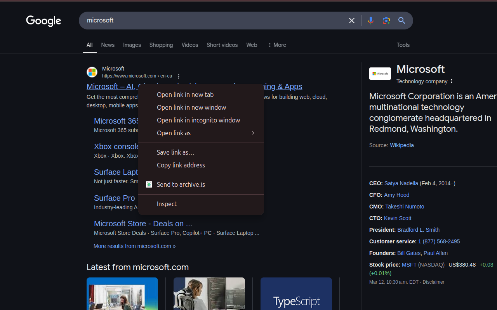

# Send to archive.is

A simple Chrome extension that makes it easy to open/archive web pages using archive.is.

## Features

- **Right-click menu**: Right-click on any link and select "Send to archive.is" to archive that link in a background tab
- **Extension icon**: Click the extension icon to archive the current page in the same tab

One of the simplest possible extensions in less than 40 lines of code.

## How it works

- Removes URL parameters (tracking codes, etc.) before archiving
- Creates clean archive links without unnecessary query parameters
- Opens archive requests in background tabs when using the context menu

## Permissions

- `contextMenus`: Required to add the right-click menu option
- `activeTab`: Required to access the current tab's URL
- `tabs`: Required to create and update tabs

## Privacy

This extension does not collect any data or violate users' privacy in any way:

- No user data is collected, stored, or transmitted
- No analytics or tracking code is included
- Everything happens locally in your browser

## License

This project is open source and available under the [MIT License](LICENSE).

## Feedback

If you have any feedback or suggestions, please open an issue or submit a pull request. All suggestions are welcome!
